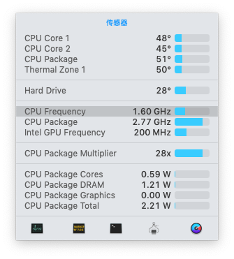

# ASUS X550JX 黑苹果相关文件
## 简介

这是华硕X550JX（国内名称为飞行堡垒FX50JX)的黑苹果相关文件, 这套配置从16年的10.11一路升级到10.14。期间修改了许多驱动方法和配置，目前已经相对较完美。EFI中还包含了ubuntu16.04和windows的启动引导，如不需要可删除。

目前master分支支持的Mac OS版本： 10.14.1， 历史版本请查看[release记录](https://github.com/gaoliang/ASUS-X550JX-Hackintosh/releases)

:warning: :warning: :warning: 

本项目提供的EFI并不能通用于所有的华硕飞行堡垒设备，直接覆盖EFI分区可能导致无法启动等问题。推荐了解clover和黑苹果驱动的相关知识后，参考config.plist和驱动修改自己的EFI文件，切勿直接盲目使用。

有问题可以提issue，有时间我会尽可能的提供帮助。 
## 本机硬件
- CPU: intel i5-4200H
- 内存: 4GB板载 + 8GB金士顿DDR3
- 硬盘: OCZ TR150 256G SSD, SATA3接口
- 网卡/蓝牙：原始网卡无解，更换为可免驱的BCM43225HMB
- 显卡：HD4600,屏蔽N卡
## 哪些可以用？
- [x] CPU变频
- [x] 显卡硬件加速(QE/CI)
- [x] 亮度调节(小太阳)
- [x] 音频, 麦克风修复参见：[issue](https://github.com/gaoliang/ASUS-X550JX-Hackintosh/issues/16#issuecomment-481984993)
- [x] HDMI输出
- [x] USB3.0 USB2.0
- [x] WIFI/蓝牙(需更换网卡)
- [x] 电量显示正常
- [x] 触控板（设置界面可能会异常）
- [x] 睡眠和唤醒
- [x] Fn快捷键
## 等待修复的问题
- [ ] 蓝牙连接蓝牙耳机时，有一定几率会出现wifi断开

## 相关驱动
黑苹果使用的开源驱动的地址和使用说明记录，方便以后的升级

| kext  | 功能 | 
| ---------- | -----------|
| [FakePCIID*](https://github.com/RehabMan/OS-X-Fake-PCI-ID)  |包括显卡，WIFI和USB等多种特性|
|[FakeSMC](https://github.com/RehabMan/OS-X-FakeSMC-kozlek)|FakeSMC is an open source SMC device driver/emulator developed by netkas.|
|[ACPIBatteryManager](https://github.com/RehabMan/OS-X-ACPI-Battery-Driver)|电量显示相关|
|[Lilu](https://github.com/vit9696/Lilu)|部分kext依赖的框架|
|[AppleALC](https://github.com/vit9696/AppleALC)|声卡驱动|
|[AppleBacklightInjector.kext](https://www.tonymacx86.com/threads/guide-laptop-backlight-control-using-applebacklightinjector-kext.218222/)|亮度调节|
|[WhateverGreen.kext](https://github.com/acidanthera/WhateverGreen)|Various patches necessary for certain ATI/AMD/Intel/Nvidia GPUs|
|||

####

## Change
[10.14.1](https://github.com/gaoliang/ASUS-X550JX-Hackintosh/releases/tag/10.14.1)
- 使用`WhateverGreen`代替`AzulPatcher4600.kext`和`IntelGraphicsFixup`
- 添加FakeSMC全家桶，使iStats Menu支持各项硬件温度，频率的查看(cpu, gpu, ssd)

- 更新clover到4784
- 使用ApfsDriverLoader64.efi代替apfs.efi

[10.13.2](https://github.com/gaoliang/ASUS-X550JX-Hackintosh/releases/tag/10.13.2)
- 解决亮度无法调节问题
使用AppleBacklightInjector.text代替之前的inetlBacklight.kext,[使用方法](https://www.tonymacx86.com/threads/guide-laptop-backlight-control-using-applebacklightinjector-kext.218222/)
- 更新clover到4276
